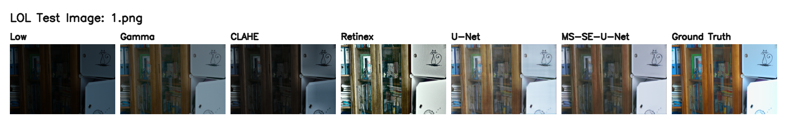
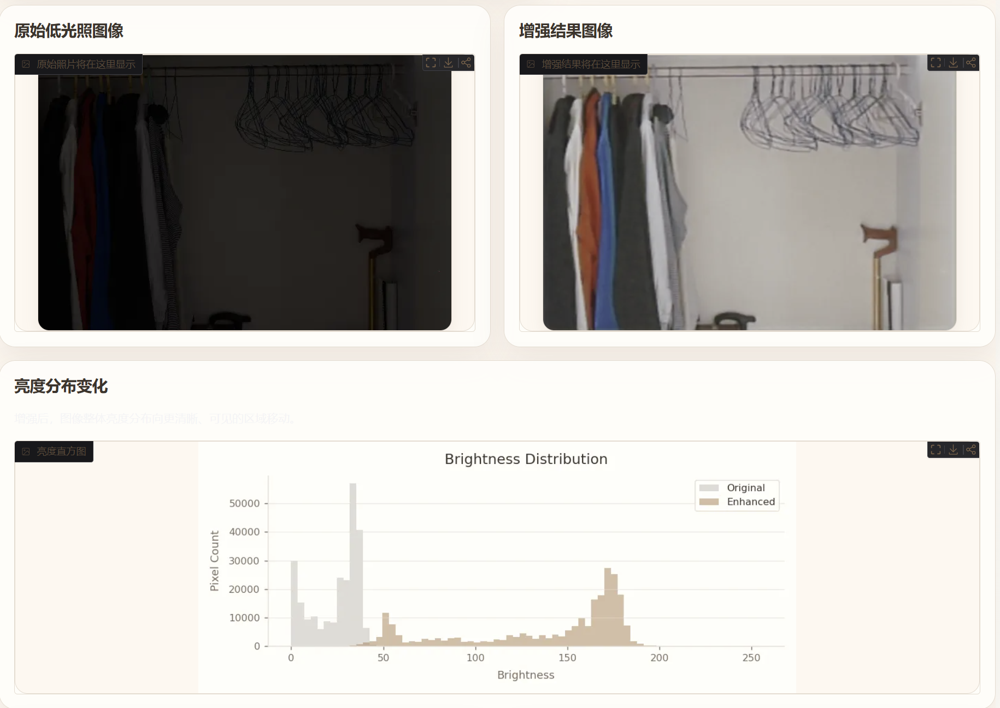

# Low-Light Image Enhancement and Warm Photo Restoration Prototype

## Overview

This project implements a complete low-light image enhancement pipeline for the LOL dataset. It includes traditional enhancement baselines, a U-Net deep learning baseline, an improved MS-SE-U-Net model, unified evaluation scripts, ablation study tooling, and a warm Gradio web demo designed as an early prototype for photo restoration.

The demo style is intentionally soft and human-centered: it presents low-light enhancement as a first step toward old photo restoration, faded photo recovery, scratch removal, and family album repair.

## Features

- Traditional methods: Gamma correction, CLAHE, Multi-Scale Retinex.
- Deep learning baselines: U-Net and MS-SE-U-Net.
- Improved model with multi-scale feature extraction and SE channel attention.
- Combined loss support: L1 + SSIM + Color + TV.
- Unified PSNR, SSIM, and inference-time evaluation.
- Ablation study table generation.
- **app.py**: Warm Gradio demo with upload, method selection, histogram comparison, and result saving.
- **app_v3.py**: Premium product landing page with Hero video, animated cards, and auth-protected sharing.
- Checkpoint resume support for training.

## Method

The main improved model is `MultiScaleSEUNet`, a U-Net style architecture enhanced with:

- **Multi-scale feature extraction**: parallel convolution branches capture details at different receptive fields.
- **SE channel attention**: channel-wise feature recalibration helps the model focus on useful enhancement cues.
- **Combined Loss**: combines pixel fidelity (L1), structural similarity (SSIM), color consistency, and total variation (TV) regularization.
- **Photo restoration prototype UI**: the Gradio app frames low-light enhancement as a warm memory restoration workflow.

## Project Structure

```text
.
├── assets/                         # Small README display images + Hero video
├── data/                           # Dataset root, ignored except small examples
├── methods/                        # Gamma, CLAHE, Retinex
├── models/                         # U-Net and MS-SE-U-Net
├── scripts/                        # Evaluation, comparison, ablation, video generation
├── utils/                          # Dataset, losses, metrics
├── app.py                          # Gradio demo (basic)
├── app_v3.py                       # Gradio demo (premium landing page)
├── infer.py                        # Traditional method inference
├── train.py                        # Training entry point
├── test.py                         # Testing and metrics entry point
├── requirements.txt
└── README.md
```

Large local folders such as `data/LOL/`, `data/raw/`, `checkpoints/*.pth`, and generated visual outputs are excluded from Git.

## Results

Final comparison on the LOL test set:

| method | average_psnr | average_ssim | average_inference_time |
| --- | ---: | ---: | ---: |
| gamma | 12.366115 | 0.637292 | 0.000252 |
| clahe | 9.173310 | 0.379503 | 0.005226 |
| retinex | 14.466908 | 0.534199 | 0.308217 |
| unet | 20.391704 | 0.802071 | 0.005154 |
| **ms_se_unet** | **20.535383** | **0.814197** | 0.012599 |

Example comparison figures:



Additional display images are available in `assets/`.

## Ablation Study

| model | multiscale | se_attention | loss | average_psnr | average_ssim | average_inference_time |
| --- | --- | --- | --- | ---: | ---: | ---: |
| unet_baseline | False | False | L1 | 20.391704 | 0.802071 | 0.005154 |
| ms_se_unet_l1 | True | True | L1 | 19.851169 | 0.780094 | 0.013368 |
| **ms_se_unet_combined** | **True** | **True** | **Combined** | **20.535383** | **0.814197** | 0.012599 |

The MS-SE-U-Net with Combined Loss achieves the best PSNR and SSIM, suggesting that multi-scale attention and the combined objective improve restoration quality.

## Gradio Demo

### app.py — Basic Demo

The web demo supports:

- Uploading one low-light image.
- Selecting Gamma, CLAHE, Retinex, U-Net, or MS-SE-U-Net.
- Displaying original and enhanced images.
- Showing inference time and method description.
- Plotting an English brightness histogram to avoid missing Chinese font issues in WSL.
- Saving enhanced images to `results/app_outputs/`.
- Optional temporary public sharing through Gradio.



### app_v3.py — Premium Product Landing Page

A polished, Apple-editorial-style landing page with warm ivory + soft gray tones, designed for product demos and team presentations.

Features:
- **Hero section** with cinematic video background (auto-fallback to static imagery if video is missing)
- **Overview cards** describing each enhancement method
- **AI Restoration Workspace** — the interactive upload/enhance UI, styled with soft shadows and rounded cards
- **Metrics table** showing comparison results inline
- **Footer** with project attribution

How to run:

```bash
# Local test
python app_v3.py

# LAN access (accessible from other devices on the same network)
python app_v3.py --server-name 0.0.0.0

# Public share with password protection
python app_v3.py --share --auth demo 123456

# Custom port
python app_v3.py --server-port 7861
```

Hero video behavior:
- If `assets/hero_memory_light.mp4` exists (≤10MB recommended), the Hero section automatically plays it as a cinematic background.
- If the video file is missing, the Hero falls back to a static gradient background — the app runs normally with no errors.

The app loads the following checkpoints at startup if available:

```text
checkpoints/unet_best.pth
checkpoints/ms_se_unet_best.pth
```

### Sharing with Teammates

To share the demo with teammates temporarily (72-hour Gradio public link):

```bash
# Basic sharing (unauthenticated)
python app_v3.py --share

# Password-protected sharing (recommended)
python app_v3.py --share --auth demo 123456
```

Keep your terminal and WSL session running while sharing. The public link is intended for temporary demos only — do not upload private or sensitive photos.

If you need to share on LAN (same WiFi):

```bash
python app_v3.py --server-name 0.0.0.0 --server-port 7860
```

Teammates can then access: `http://<your-LAN-IP>:7860`

## Installation

Create and activate a virtual environment:

```bash
python -m venv .venv
source .venv/bin/activate
pip install -r requirements.txt
```

`requirements.txt` does not pin a CPU-only PyTorch wheel. If you need CUDA acceleration, install `torch` and `torchvision` using the command recommended by the official PyTorch website for your CUDA version, then install the remaining requirements.

## Dataset Preparation

Prepare the LOL dataset in this structure:

```text
data/LOL/
├── train/
│   ├── low/
│   └── high/
└── test/
    ├── low/
    └── high/
```

Requirements:

- `low/` and `high/` images must match by filename.
- Supported formats: `.jpg`, `.jpeg`, `.png`.
- Images are loaded as RGB tensors and resized to `256x256` by default.

The dataset is ignored by Git:

```text
data/LOL/
data/raw/
```

## Training

Train the U-Net baseline:

```bash
python train.py --data-root data/LOL --model unet --loss l1 --epochs 30 --batch-size 8 --lr 1e-4 --device cuda
```

Train MS-SE-U-Net with Combined Loss:

```bash
python train.py --data-root data/LOL --model ms_se_unet --loss combined --epochs 30 --batch-size 8 --lr 1e-4 --device cuda
```

Resume training:

```bash
python train.py --data-root data/LOL --model ms_se_unet --loss combined --epochs 30 --batch-size 8 --lr 1e-4 --device cuda --resume checkpoints/ms_se_unet_latest.pth
```

Ablation run for MS-SE-U-Net + L1:

```bash
python train.py --data-root data/LOL --model ms_se_unet --loss l1 --epochs 30 --batch-size 8 --lr 1e-4 --device cuda --run-name ms_se_unet_l1
```

## Testing

Test U-Net:

```bash
python test.py --data-root data/LOL --model unet --checkpoint checkpoints/unet_best.pth --device cuda --save-original-size
```

Test MS-SE-U-Net:

```bash
python test.py --data-root data/LOL --model ms_se_unet --checkpoint checkpoints/ms_se_unet_best.pth --device cuda --save-original-size
```

Test the ablation checkpoint:

```bash
python test.py --data-root data/LOL --model ms_se_unet --run-name ms_se_unet_l1 --checkpoint checkpoints/ms_se_unet_l1_best.pth --device cuda --save-original-size
```

Generate traditional method comparison metrics:

```bash
python scripts/evaluate_traditional.py --data-root data/LOL
```

Generate comparison figures:

```bash
python scripts/make_comparison_figure.py --data-root data/LOL
```

Generate the ablation table:

```bash
python scripts/make_ablation_table.py
```

## Launch Web App

### Basic app.py

Local or LAN demo:

```bash
python app.py
```

Local browser:

```text
http://127.0.0.1:7860
```

LAN browser:

```text
http://your-lan-ip:7860
```

Temporary public sharing:

```bash
python app.py --share
```

Optional password protection:

```bash
python app.py --share --auth demo 123456
```

When using public sharing, keep the computer and WSL terminal running. The public link is intended only for temporary demos; do not upload private photos.

### Premium app_v3.py

See the [Gradio Demo — app_v3.py](#app_v3py--premium-product-landing-page) section above for detailed run and share instructions.

## Hero Video Generation (Optional)

The premium landing page (`app_v3.py`) can display a cinematic hero background video. To generate the video:

```bash
export MINIMAX_API_KEY="your-key-here"
python scripts/generate_hero_video_minimax.py
```

The script uses the MiniMax-Hailuo-2.3 API (pay-as-you-go) to create `assets/hero_memory_light.mp4`. This step is entirely optional — if no video file is present, `app_v3.py` gracefully falls back to a static gradient background.

## Notes About Checkpoints and Dataset

This repository intentionally excludes large files:

- `data/LOL/`
- `data/raw/`
- `checkpoints/*.pth`
- generated result images
- `results/app_outputs/`
- `assets/hero_memory_light_original.mp4` (large original video)

To reproduce deep learning results, place trained checkpoints under `checkpoints/` with names such as:

```text
checkpoints/unet_best.pth
checkpoints/ms_se_unet_best.pth
checkpoints/ms_se_unet_l1_best.pth
```

Small CSV metrics may be kept for documentation, while large image folders and `.pth` files should not be committed.

## Security Notes

Do **not** commit the following to Git:

| Category | Examples |
| --- | --- |
| API keys | `MINIMAX_API_KEY`, OpenAI `sk-...` keys, `kaggle.json` |
| Environment files | `.env`, `access_token` |
| Datasets | `data/LOL/`, `data/raw/`, `*.zip` |
| Model weights | `checkpoints/*.pth`, `results/**/*.pth` |
| Large results | `results/app_outputs/`, `results/stage*/`, bulk `*.png`/`*.jpg` |
| Virtual environment | `.venv/`, `__pycache__/`, `*.pyc` |
| Large videos | `assets/hero_memory_light_original.mp4` |

All of the above are covered by `.gitignore`. Before committing, verify with:

```bash
git status --short
find . -type f -size +20M | grep -v '.venv/'
grep -rn "sk-" . --exclude-dir=.git --exclude-dir=.venv || echo "Clean"
```

## Future Work

- Add a public checkpoint download mechanism through GitHub Releases or cloud storage.
- Extend the restoration pipeline to faded photo recovery.
- Add scratch and noise removal modules.
- Improve color restoration for old family photos.
- Add more qualitative comparison examples and a polished Gradio screenshot.
